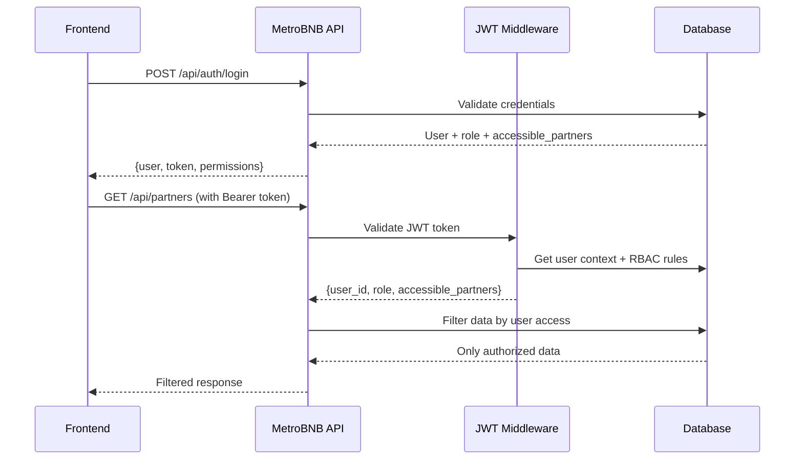

# MetroBNB API - Frontend Integration Guide

> **Complete integration guide for the RBAC-secured MetroBNB API**  
> **Authentication**: JWT with Supabase tokens  
> **Security**: Role-Based Access Control (RBAC)  
> **Status**: ✅ Production Ready

## 🔐 Authentication & RBAC System

### Authentication Flow


### User Roles & Data Access
- **Admin**: All partners (6), all units, all bookings
- **Manager**: All partners (6), all units, all bookings  
- **Staff**: Assigned partners only (2), related units/bookings
- **Partner**: Own data only (1 partner), own units/bookings

## 🚀 Quick Start

### 1. Environment Setup
```typescript
// nuxt.config.ts
export default defineNuxtConfig({
  modules: ['@pinia/nuxt'],
  runtimeConfig: {
    public: { 
      apiBase: 'http://localhost:8000' 
    }
  }
})
```

### 2. Install Dependencies
```bash
npm install @pinia/nuxt
```

### 3. Test API Access
```bash
# Test different user roles
curl -X POST http://localhost:8000/api/auth/test-login \
  -H "Content-Type: application/json" \
  -d '{"role": "admin"}'

curl -X POST http://localhost:8000/api/auth/test-login \
  -H "Content-Type: application/json" \
  -d '{"role": "partner", "email": "hiroaki@partner.test"}'
```

## 🔧 Implementation

### 1. Authentication Store
```typescript
// stores/auth.ts
import { defineStore } from 'pinia'

interface User {
  id: string
  email: string
  name: string
  role: 'admin' | 'manager' | 'staff' | 'partner'
  organization_id: string
  accessible_partners?: string[]
  permissions: string[]
}

export const useAuthStore = defineStore('auth', () => {
  const user = ref<User | null>(null)
  const token = ref<string | null>(null)
  
  const isAuthenticated = computed(() => !!token.value)
  
  const login = async (email: string, password: string) => {
    const { $api } = useNuxtApp()
    
    const response = await $api('/api/auth/login', {
      method: 'POST',
      body: { email, password }
    })
    
    if (response.success) {
      user.value = response.user
      token.value = response.token
      
      // Store in cookie for persistence
      const tokenCookie = useCookie('auth_token', {
        maxAge: 60 * 60 * 24 * 7 // 7 days
      })
      tokenCookie.value = response.token
      
      await navigateTo('/dashboard')
    }
    
    return response
  }
  
  const logout = async () => {
    user.value = null
    token.value = null
    
    const tokenCookie = useCookie('auth_token')
    tokenCookie.value = null
    
    await navigateTo('/login')
  }
  
  const hasPermission = (permission: string) => {
    return user.value?.permissions.includes(permission) || false
  }
  
  const canAccessPartner = (partnerId: string) => {
    if (user.value?.role === 'admin' || user.value?.role === 'manager') {
      return true
    }
    return user.value?.accessible_partners?.includes(partnerId) || false
  }
  
  return { 
    user, 
    token, 
    isAuthenticated, 
    login, 
    logout, 
    hasPermission, 
    canAccessPartner 
  }
})
```

### 2. API Plugin with JWT Authentication
```typescript
// plugins/api.client.ts
export default defineNuxtPlugin(() => {
  const config = useRuntimeConfig()
  
  const api = $fetch.create({
    baseURL: config.public.apiBase,
    onRequest({ options }) {
      // Add JWT token to all requests
      const tokenCookie = useCookie('auth_token')
      if (tokenCookie.value) {
        options.headers = {
          ...options.headers,
          Authorization: `Bearer ${tokenCookie.value}`
        }
      }
    },
    onResponseError({ response }) {
      // Handle authentication errors
      if (response.status === 401) {
        const tokenCookie = useCookie('auth_token')
        tokenCookie.value = null
        navigateTo('/login')
      }
    }
  })
  
  return { provide: { api } }
})
```

### 3. Login Page
```vue
<!-- pages/login.vue -->
<template>
  <div class="min-h-screen flex items-center justify-center">
    <div class="max-w-md w-full space-y-8">
      <h2 class="text-3xl font-bold text-center">MetroBNB Login</h2>
      
      <!-- Test Login Buttons (Development) -->
      <div class="space-y-2">
        <button @click="testLogin('admin')" class="w-full bg-blue-600 text-white py-2 rounded">
          🔑 Test Login - Admin (6 partners)
        </button>
        <button @click="testLogin('staff')" class="w-full bg-green-600 text-white py-2 rounded">
          👥 Test Login - Staff (2 partners)
        </button>
        <button @click="testLogin('partner')" class="w-full bg-purple-600 text-white py-2 rounded">
          🏠 Test Login - Partner (1 partner)
        </button>
      </div>
      
      <div class="border-t pt-6">
        <!-- Production Login Form -->
        <form @submit.prevent="handleLogin" class="space-y-4">
          <input 
            v-model="email" 
            type="email" 
            placeholder="Email" 
            class="w-full px-3 py-2 border rounded"
            required
          />
          <input 
            v-model="password" 
            type="password" 
            placeholder="Password" 
            class="w-full px-3 py-2 border rounded"
            required
          />
          <button 
            type="submit" 
            class="w-full bg-gray-800 text-white py-2 rounded"
            :disabled="loading"
          >
            {{ loading ? 'Logging in...' : 'Login' }}
          </button>
        </form>
      </div>
    </div>
  </div>
</template>

<script setup>
const authStore = useAuthStore()
const email = ref('')
const password = ref('')
const loading = ref(false)

const testLogin = async (role: string) => {
  loading.value = true
  try {
    const { $api } = useNuxtApp()
    const testCredentials = {
      admin: { email: 'tonynini1998@gmail.com', password: 'TempPassword123!' },
      staff: { email: 'staff@metrobnb.test', password: 'TestPass123!' },
      partner: { email: 'hiroaki@partner.test', password: 'TestPass123!' }
    }
    
    const creds = testCredentials[role]
    await authStore.login(creds.email, creds.password)
  } finally {
    loading.value = false
  }
}

const handleLogin = async () => {
  loading.value = true
  try {
    await authStore.login(email.value, password.value)
  } finally {
    loading.value = false
  }
}
</script>
```

### 4. Permission-Based Components
```vue
<!-- components/PermissionGuard.vue -->
<template>
  <div v-if="hasAccess">
    <slot />
  </div>
  <div v-else-if="$slots.fallback">
    <slot name="fallback" />
  </div>
</template>

<script setup>
interface Props {
  permission?: string
  role?: string[]
  partnerId?: string
}

const props = defineProps<Props>()
const authStore = useAuthStore()

const hasAccess = computed(() => {
  if (!authStore.user) return false
  
  // Check permission
  if (props.permission && !authStore.hasPermission(props.permission)) {
    return false
  }
  
  // Check role
  if (props.role && !props.role.includes(authStore.user.role)) {
    return false
  }
  
  // Check partner access
  if (props.partnerId && !authStore.canAccessPartner(props.partnerId)) {
    return false
  }
  
  return true
})
</script>
```

### 5. Data Fetching with RBAC
```typescript
// composables/usePartners.ts
export const usePartners = () => {
  const { $api } = useNuxtApp()
  
  return useAsyncData('partners', async () => {
    // API automatically filters based on user role and accessible_partners
    const response = await $api('/api/partners')
    return response.success ? response.data : []
  })
}

// composables/useUnits.ts  
export const useUnits = (partnerId?: string) => {
  const { $api } = useNuxtApp()
  
  return useAsyncData(`units-${partnerId || 'all'}`, async () => {
    const url = partnerId ? `/api/units?partner_id=${partnerId}` : '/api/units'
    const response = await $api(url)
    return response.success ? response.data : []
  })
}
```

### 6. Role-Based Dashboard
```vue
<!-- pages/dashboard.vue -->
<template>
  <div>
    <div class="mb-6">
      <h1 class="text-2xl font-bold">
        Welcome, {{ authStore.user?.name }}
      </h1>
      <p class="text-gray-600">
        Role: {{ authStore.user?.role }} | 
        Organization: {{ authStore.user?.organization_id }}
      </p>
    </div>
    
    <!-- Admin/Manager View -->
    <div v-if="authStore.user?.role === 'admin' || authStore.user?.role === 'manager'">
      <div class="grid grid-cols-3 gap-6">
        <div class="bg-white p-6 rounded-lg shadow">
          <h3 class="text-lg font-semibold">Partners</h3>
          <p class="text-3xl font-bold">{{ partners?.length || 0 }}</p>
        </div>
        <div class="bg-white p-6 rounded-lg shadow">
          <h3 class="text-lg font-semibold">Units</h3>
          <p class="text-3xl font-bold">{{ units?.length || 0 }}</p>
        </div>
        <div class="bg-white p-6 rounded-lg shadow">
          <h3 class="text-lg font-semibold">Bookings</h3>
          <p class="text-3xl font-bold">{{ bookings?.length || 0 }}</p>
        </div>
      </div>
    </div>
    
    <!-- Staff View -->
    <div v-else-if="authStore.user?.role === 'staff'">
      <div class="bg-white p-6 rounded-lg shadow">
        <h3 class="text-lg font-semibold">Assigned Partners</h3>
        <p class="text-3xl font-bold">{{ partners?.length || 0 }}</p>
        <p class="text-sm text-gray-600">
          You have access to {{ authStore.user?.accessible_partners?.length || 0 }} partners
        </p>
      </div>
    </div>
    
    <!-- Partner View -->
    <div v-else-if="authStore.user?.role === 'partner'">
      <div class="grid grid-cols-2 gap-6">
        <div class="bg-white p-6 rounded-lg shadow">
          <h3 class="text-lg font-semibold">My Units</h3>
          <p class="text-3xl font-bold">{{ units?.length || 0 }}</p>
        </div>
        <div class="bg-white p-6 rounded-lg shadow">
          <h3 class="text-lg font-semibold">My Bookings</h3>
          <p class="text-3xl font-bold">{{ bookings?.length || 0 }}</p>
        </div>
      </div>
    </div>
  </div>
</template>

<script setup>
definePageMeta({
  middleware: 'auth'
})

const authStore = useAuthStore()
const { data: partners } = await usePartners()
const { data: units } = await useUnits()
const { data: bookings } = await useBookings()
</script>
```

### 7. Auth Middleware
```typescript
// middleware/auth.ts
export default defineNuxtRouteMiddleware(() => {
  const authStore = useAuthStore()
  
  if (!authStore.isAuthenticated) {
    return navigateTo('/login')
  }
})
```

## 📊 API Endpoints

### Authentication
```bash
# Login
POST /api/auth/login
Body: {"email": "user@example.com", "password": "password"}

# Test login (development)
POST /api/auth/test-login  
Body: {"role": "admin|staff|partner", "email": "optional"}
```

### Data Endpoints (RBAC Filtered)
```bash
# Get partners (filtered by user role)
GET /api/partners

# Get units (filtered by accessible partners)
GET /api/units

# Get bookings (filtered by accessible partners)
GET /api/bookings

# Get expenses (filtered by accessible partners)
GET /api/expenses

# Get analytics (filtered by accessible partners)
GET /api/analytics/dashboard
```

## 🔍 Testing Different Roles

### Test User Credentials
```typescript
const TEST_USERS = {
  admin: { 
    email: 'tonynini1998@gmail.com', 
    password: 'TempPassword123!',
    expected_partners: 6 
  },
  staff: { 
    email: 'staff@metrobnb.test', 
    password: 'TestPass123!',
    expected_partners: 2 
  },
  partner: { 
    email: 'hiroaki@partner.test', 
    password: 'TestPass123!',
    expected_partners: 1 
  }
}
```

### Verification Commands
```bash
# Test admin access (should see 6 partners)
curl -X POST http://localhost:8000/api/auth/login \
  -H "Content-Type: application/json" \
  -d '{"email": "tonynini1998@gmail.com", "password": "TempPassword123!"}'

# Use returned token
curl -H "Authorization: Bearer <token>" \
  http://localhost:8000/api/partners

# Test partner access (should see 1 partner)
curl -X POST http://localhost:8000/api/auth/login \
  -H "Content-Type: application/json" \
  -d '{"email": "hiroaki@partner.test", "password": "TestPass123!"}'

curl -H "Authorization: Bearer <token>" \
  http://localhost:8000/api/partners
```

## 🎯 Expected Results

### Admin User (tonynini1998@gmail.com)
- **Partners**: 6 (all partners)
- **Units**: 6 (all units)
- **Bookings**: 154 (all bookings)
- **Permissions**: Full access to all data

### Staff User (staff@metrobnb.test)
- **Partners**: 2 (assigned partners only)
- **Units**: Units from assigned partners only
- **Bookings**: Bookings from assigned partners only
- **Permissions**: Limited to assigned data

### Partner User (hiroaki@partner.test)
- **Partners**: 1 (own partner record)
- **Units**: Own units only
- **Bookings**: Own bookings only
- **Permissions**: Own data only

## 🔒 Security Features

### JWT Token Validation
- All API requests require `Authorization: Bearer <token>` header
- Tokens contain user ID and are validated against database
- Invalid/expired tokens return 401 Unauthorized

### Role-Based Data Filtering
- Database queries automatically filter by user's accessible partners
- Admin/Manager: No filtering (see all data)
- Staff: Filter by `user_partner_access` table
- Partner: Filter by own partner ID only

### Permission System
- Each role has specific permissions
- UI components check permissions before rendering
- API endpoints validate permissions before processing

## 📋 Implementation Checklist

### Phase 1: Authentication (30 min)
- [ ] Install Pinia: `npm install @pinia/nuxt`
- [ ] Create auth store with JWT handling
- [ ] Create API plugin with token injection
- [ ] Create login page with test buttons
- [ ] Test different user roles

### Phase 2: RBAC Integration (45 min)
- [ ] Create permission guard component
- [ ] Implement role-based navigation
- [ ] Create data composables with RBAC
- [ ] Build role-specific dashboard
- [ ] Test data filtering

### Phase 3: Production Ready (30 min)
- [ ] Add error handling for 401/403
- [ ] Implement loading states
- [ ] Add form validation
- [ ] Test all user flows
- [ ] Verify security isolation

## 🚀 Quick Test

```bash
# 1. Start the API
docker-compose up -d

# 2. Test admin login
curl -X POST http://localhost:8000/api/auth/login \
  -H "Content-Type: application/json" \
  -d '{"email": "tonynini1998@gmail.com", "password": "TempPassword123!"}'

# 3. Use token to get partners
curl -H "Authorization: Bearer <your-token>" \
  http://localhost:8000/api/partners

# Expected: 6 partners for admin, 2 for staff, 1 for partner
```

**🔐 RBAC System Status: FULLY SECURE - Users can only access their authorized data**