# Authentication Module

> **Production-Ready Supabase Authentication with RBAC and User Management**

## 🔐 Authentication System Overview

MetroBNB uses **Supabase Authentication** for production-grade security with role-based access control (RBAC) and multi-tenant organization support.

### **Key Features:**
- ✅ **Real Supabase Auth** - Production password validation
- ✅ **Admin User Creation** - Create users via Supabase Admin API
- ✅ **Secure Password Setup** - Users set their own passwords
- ✅ **RBAC System** - Role-based data filtering
- ✅ **Multi-tenant** - Organization-based isolation
- ✅ **JWT Tokens** - Supabase session management

## 🚀 Authentication Endpoints

### POST /api/auth/login
**User login with email and password**

**Request:**
```typescript
{
  email: string
  password: string
}
```

**Response:**
```typescript
{
  success: boolean
  data: {
    user: {
      id: string
      email: string
      name: string
      role: 'admin' | 'manager' | 'staff' | 'partner'
      organization_id: string
      accessible_partners: string[]  // For RBAC filtering
      permissions: string[]
    }
    organization: {
      id: string
      name: string
      plan: string
    }
    access_token: string
    refresh_token: string
    expires_in: number
  }
  message: string
}
```

### POST /api/auth/register
**Organization registration (creates new organization + owner)**

**Request:**
```typescript
{
  email: string
  password: string
  name: string
  organization_name: string
  plan?: string  // Default: "starter"
}
```

### POST /api/auth/set-initial-password
**Set password for admin-created users (Public endpoint)**

**Request:**
```typescript
{
  email: string
  new_password: string
}
```

**Response:**
```typescript
{
  success: boolean
  message: "Password set successfully. You can now login with your new password."
}
```

### POST /api/auth/reset-password
**Password reset via email (Public endpoint)**

**Request:**
```typescript
{
  email: string
}
```

### POST /api/auth/change-password
**Change password for authenticated users**

**Request:**
```typescript
{
  current_password: string
  new_password: string
}
```

## 👥 User Management Endpoints

### POST /api/users/
**Admin creates new users (Admin/Manager only)**

**Request:**
```typescript
{
  email: string
  name: string
  role: 'admin' | 'manager' | 'staff' | 'partner'
  accessible_partners?: string[]  // For staff/partner roles
}
```

**Response:**
```typescript
{
  success: boolean
  data: {
    id: string
    email: string
    name: string
    role: string
  }
  message: string
}
```

**RBAC Requirements:**
- Only `admin` and `manager` roles can create users
- Users created in same organization
- Temporary password: `TempPass123!`

### GET /api/users/profile
**Get current user profile**

### PATCH /api/users/profile
**Update user profile**

## 🔄 Complete User Onboarding Workflow

### **Admin Creates Partner User:**

```mermaid
sequenceDiagram
    participant Admin as MetroBNB Admin
    participant API as MetroBNB API
    participant Supabase as Supabase Auth
    participant Partner as Partner User
    
    Admin->>API: POST /api/users/ (create partner)
    API->>Supabase: Admin.createUser() with temp password
    Supabase-->>API: User created with ID
    API-->>Admin: ✅ User created (temp: TempPass123!)
    
    Note over Partner: Partner receives login credentials
    
    Partner->>API: POST /api/auth/set-initial-password
    API->>Supabase: Admin.updateUser() with new password
    Supabase-->>API: Password updated
    API-->>Partner: ✅ Password set successfully
    
    Partner->>API: POST /api/auth/login (with new password)
    API->>Supabase: signInWithPassword()
    Supabase-->>API: JWT tokens + user data
    API-->>Partner: ✅ Login successful + RBAC data
```



### **Step-by-Step Implementation:**

**1. Admin Creates User:**
```bash
POST /api/users/
{
  "email": "partner@property.com",
  "name": "John Partner",
  "role": "partner",
  "accessible_partners": ["partner-uuid"]
}
# → Creates user in Supabase with temp password "TempPass123!"
```

**2. Partner Sets Password:**
```bash
POST /api/auth/set-initial-password
{
  "email": "partner@property.com",
  "new_password": "MySecurePassword123!"
}
# → Updates password in Supabase securely
```

**3. Partner Login:**
```bash
POST /api/auth/login
{
  "email": "partner@property.com",
  "password": "MySecurePassword123!"
}
# → Real Supabase authentication with RBAC data
```

## 🔒 RBAC (Role-Based Access Control)

### **Role Hierarchy:**
- **Admin** - Full system access, all organizations
- **Manager** - Full access within organization
- **Staff** - Limited to assigned partners
- **Partner** - Only their own data

### **Data Filtering:**
```typescript
// Automatic filtering based on user role:
if (user.role === 'admin' || user.role === 'manager') {
  // See all data in organization
  accessible_partners = []  // Empty = all partners
} else if (user.role === 'staff' || user.role === 'partner') {
  // See only assigned partner data
  accessible_partners = user.accessible_partners
}
```

### **RBAC Implementation:**
All API endpoints automatically filter data based on:
- User's `organization_id`
- User's `accessible_partners` array
- User's `role` and `permissions`

## 🔧 Frontend Implementation

### Authentication Store
```typescript
// stores/auth.ts
import { defineStore } from 'pinia'

interface User {
  id: string
  email: string
  name: string
  role: 'admin' | 'manager' | 'staff' | 'partner'
  organization_id: string
  accessible_partners: string[]
  permissions: string[]
}

interface Organization {
  id: string
  name: string
  plan: string
}

export const useAuthStore = defineStore('auth', () => {
  const user = ref<User | null>(null)
  const organization = ref<Organization | null>(null)
  const accessToken = ref<string | null>(null)
  const isAuthenticated = computed(() => !!user.value)

  const login = async (email: string, password: string) => {
    const { $api } = useNuxtApp()
    
    const response = await $api('/api/auth/login', {
      method: 'POST',
      body: { email, password }
    })
    
    if (response.success) {
      user.value = response.data.user
      organization.value = response.data.organization
      accessToken.value = response.data.access_token
      
      // Store in localStorage for persistence
      localStorage.setItem('auth_token', response.data.access_token)
      localStorage.setItem('user', JSON.stringify(response.data.user))
    }
    
    return response
  }

  const setInitialPassword = async (email: string, newPassword: string) => {
    const { $api } = useNuxtApp()
    
    return await $api('/api/auth/set-initial-password', {
      method: 'POST',
      body: { email, new_password: newPassword }
    })
  }

  const logout = () => {
    user.value = null
    organization.value = null
    accessToken.value = null
    localStorage.removeItem('auth_token')
    localStorage.removeItem('user')
  }

  const hasRole = (role: string) => {
    return user.value?.role === role
  }

  const canAccessPartner = (partnerId: string) => {
    if (!user.value) return false
    
    // Admin/Manager can access all partners
    if (['admin', 'manager'].includes(user.value.role)) {
      return true
    }
    
    // Staff/Partner can only access assigned partners
    return user.value.accessible_partners.includes(partnerId)
  }

  const hasPermission = (permission: string) => {
    return user.value?.permissions.includes(permission) || false
  }

  return {
    user,
    organization,
    accessToken,
    isAuthenticated,
    login,
    setInitialPassword,
    logout,
    hasRole,
    canAccessPartner,
    hasPermission
  }
})
```

### Login Component
```vue
<!-- components/LoginForm.vue -->
<template>
  <div class="login-form">
    <h2 class="text-2xl font-bold mb-6">Login to MetroBNB</h2>
    
    <form @submit.prevent="handleLogin" class="space-y-4">
      <div>
        <label class="block text-sm font-medium mb-1">Email</label>
        <input
          v-model="form.email"
          type="email"
          required
          class="w-full border rounded-lg p-3"
          placeholder="your@email.com"
        />
      </div>
      
      <div>
        <label class="block text-sm font-medium mb-1">Password</label>
        <input
          v-model="form.password"
          type="password"
          required
          class="w-full border rounded-lg p-3"
          placeholder="Your password"
        />
      </div>
      
      <button
        type="submit"
        :disabled="loading"
        class="w-full bg-blue-600 text-white py-3 rounded-lg font-medium disabled:opacity-50"
      >
        {{ loading ? 'Logging in...' : 'Login' }}
      </button>
    </form>
    
    <div class="mt-4 text-center">
      <button
        @click="showPasswordReset = true"
        class="text-blue-600 text-sm hover:underline"
      >
        Forgot your password?
      </button>
    </div>
    
    <!-- Password Reset Modal -->
    <div v-if="showPasswordReset" class="fixed inset-0 bg-black bg-opacity-50 flex items-center justify-center">
      <div class="bg-white rounded-lg p-6 w-96">
        <h3 class="text-lg font-bold mb-4">Reset Password</h3>
        <input
          v-model="resetEmail"
          type="email"
          placeholder="Enter your email"
          class="w-full border rounded-lg p-3 mb-4"
        />
        <div class="flex gap-3">
          <button
            @click="handlePasswordReset"
            class="flex-1 bg-blue-600 text-white py-2 rounded font-medium"
          >
            Send Reset Email
          </button>
          <button
            @click="showPasswordReset = false"
            class="flex-1 bg-gray-300 text-gray-700 py-2 rounded font-medium"
          >
            Cancel
          </button>
        </div>
      </div>
    </div>
  </div>
</template>

<script setup>
const authStore = useAuthStore()
const router = useRouter()

const loading = ref(false)
const showPasswordReset = ref(false)
const resetEmail = ref('')

const form = ref({
  email: '',
  password: ''
})

const handleLogin = async () => {
  loading.value = true
  try {
    const response = await authStore.login(form.value.email, form.value.password)
    
    if (response.success) {
      // Redirect based on role
      if (authStore.hasRole('partner')) {
        router.push('/partner/dashboard')
      } else {
        router.push('/admin/dashboard')
      }
    } else {
      alert('Login failed: ' + response.error?.message)
    }
  } finally {
    loading.value = false
  }
}

const handlePasswordReset = async () => {
  const { $api } = useNuxtApp()
  
  const response = await $api('/api/auth/reset-password', {
    method: 'POST',
    body: { email: resetEmail.value }
  })
  
  if (response.success) {
    alert('Password reset email sent!')
    showPasswordReset.value = false
  }
}
</script>
```

### Password Setup Component
```vue
<!-- components/PasswordSetup.vue -->
<template>
  <div class="password-setup">
    <h2 class="text-2xl font-bold mb-6">Set Your Password</h2>
    <p class="text-gray-600 mb-6">
      Your account has been created. Please set a secure password to continue.
    </p>
    
    <form @submit.prevent="handlePasswordSetup" class="space-y-4">
      <div>
        <label class="block text-sm font-medium mb-1">Email</label>
        <input
          v-model="form.email"
          type="email"
          required
          class="w-full border rounded-lg p-3"
        />
      </div>
      
      <div>
        <label class="block text-sm font-medium mb-1">New Password</label>
        <input
          v-model="form.password"
          type="password"
          required
          minlength="8"
          class="w-full border rounded-lg p-3"
          placeholder="Minimum 8 characters"
        />
      </div>
      
      <div>
        <label class="block text-sm font-medium mb-1">Confirm Password</label>
        <input
          v-model="form.confirmPassword"
          type="password"
          required
          class="w-full border rounded-lg p-3"
        />
      </div>
      
      <button
        type="submit"
        :disabled="loading || form.password !== form.confirmPassword"
        class="w-full bg-green-600 text-white py-3 rounded-lg font-medium disabled:opacity-50"
      >
        {{ loading ? 'Setting Password...' : 'Set Password' }}
      </button>
    </form>
  </div>
</template>

<script setup>
const authStore = useAuthStore()
const router = useRouter()

const loading = ref(false)
const form = ref({
  email: '',
  password: '',
  confirmPassword: ''
})

const handlePasswordSetup = async () => {
  if (form.value.password !== form.value.confirmPassword) {
    alert('Passwords do not match')
    return
  }
  
  loading.value = true
  try {
    const response = await authStore.setInitialPassword(
      form.value.email,
      form.value.password
    )
    
    if (response.success) {
      alert('Password set successfully! You can now login.')
      router.push('/login')
    } else {
      alert('Failed to set password: ' + response.error?.message)
    }
  } finally {
    loading.value = false
  }
}
</script>
```

## 🔐 Security Features

### **Production Security:**
- ✅ **Real Password Validation** - Supabase handles hashing and validation
- ✅ **JWT Tokens** - Secure session management
- ✅ **Password Reset** - Email-based password recovery
- ✅ **Account Lockout** - Supabase handles brute force protection
- ✅ **Secure Storage** - Passwords never stored in our database

### **RBAC Security:**
- ✅ **Data Isolation** - Users only see their organization's data
- ✅ **Partner Filtering** - Staff/Partners limited to assigned data
- ✅ **Permission Checks** - Role-based feature access
- ✅ **Automatic Filtering** - Server-side data filtering

### **Best Practices:**
- ✅ **Temporary Passwords** - Admin-created users get temp passwords
- ✅ **Password Requirements** - Minimum 8 characters
- ✅ **Secure Endpoints** - Password setup is public, others require auth
- ✅ **Token Management** - Automatic token refresh and validation

## 📱 Mobile Considerations

### **PWA Support:**
- Secure token storage in localStorage
- Offline authentication state management
- Biometric authentication (future enhancement)
- Push notifications for password resets

### **Security on Mobile:**
- HTTPS-only communication
- Secure token storage
- Automatic logout on app backgrounding
- Certificate pinning (production)

This authentication system provides enterprise-grade security with a smooth user experience for all roles in the MetroBNB platform.