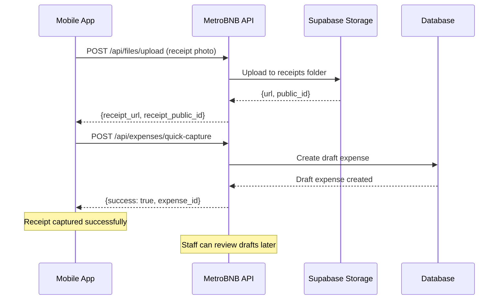
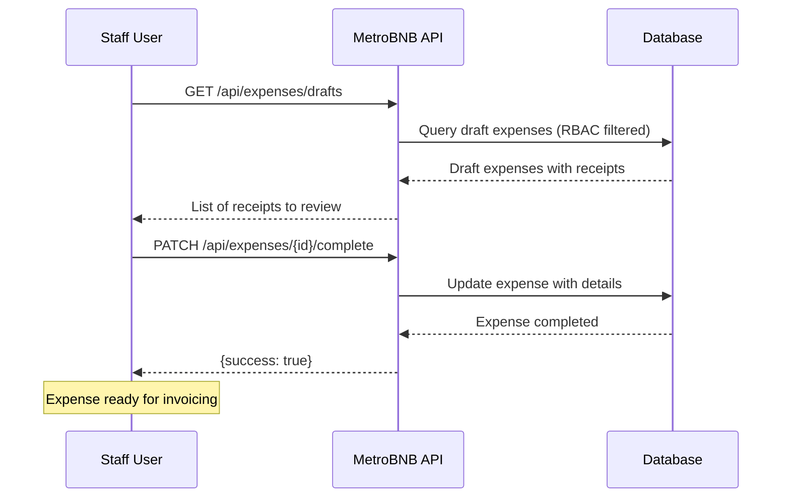

# Expenses Module

> **Expense Management with Receipt System and RBAC Filtering**

## 🔐 RBAC Data Filtering

Expenses are filtered based on user role and `accessible_partners`:

- **Admin/Manager**: See ALL expenses in organization
- **Staff**: See only expenses from assigned partners in `accessible_partners`
- **Partner**: See only expenses from their own partner

## 📋 Expense Endpoints

### GET /api/expenses
**Get paginated expenses list (RBAC filtered with comprehensive filtering)**

**Query Parameters:**
```typescript
{
  page?: number             // Default: 1
  limit?: number            // Default: 10
  search?: string           // Search by description, vendor, notes
  sort_by?: string          // date, amount, type, status, created_at
  sort_order?: 'asc' | 'desc'  // Default: desc
  
  // Filter by relationships
  partner_id?: string       // Filter by specific partner
  unit_id?: string          // Filter by specific unit
  
  // Filter by expense properties
  type?: string             // supplies, maintenance, utilities, cleaning, other
  status?: string           // draft, completed, approved
  paid_by?: string          // metrobnb, partner
  paid?: boolean            // true = paid, false = unpaid
  billable?: boolean        // true = billable, false = non-billable ✅
  needs_review?: boolean    // true = needs review, false = reviewed
  
  // Date filtering
  month?: string            // YYYY-MM format (e.g., "2025-01")
  date_from?: string        // YYYY-MM-DD format
  date_to?: string          // YYYY-MM-DD format
  
  // Amount filtering
  amount_min?: number       // Minimum amount
  amount_max?: number       // Maximum amount
}
```

**Response:**
```typescript
{
  success: boolean
  data: {
    items: Expense[]
    total: number
    page: number
    limit: number
    pages: number
    summary: {
      total_expenses: number
      total_amount: number
      by_type: Record<string, number>
      by_status: Record<string, number>
    }
  }
}
```

### GET /api/expenses/drafts
**Get draft expenses needing review (RBAC filtered)**

**Response:**
```typescript
{
  success: boolean
  data: {
    items: Expense[]
    total: number
  }
}
```

**Usage Examples:**
```bash
# Get all expenses
curl -H "Authorization: Bearer <token>" \
  "http://localhost:8000/api/expenses"

# Filter billable expenses only
curl -H "Authorization: Bearer <token>" \
  "http://localhost:8000/api/expenses?billable=true"

# Filter non-billable expenses
curl -H "Authorization: Bearer <token>" \
  "http://localhost:8000/api/expenses?billable=false"

# Filter by partner and date range
curl -H "Authorization: Bearer <token>" \
  "http://localhost:8000/api/expenses?partner_id=123&date_from=2025-01-01&date_to=2025-01-31"

# Filter by amount range and type
curl -H "Authorization: Bearer <token>" \
  "http://localhost:8000/api/expenses?amount_min=100&amount_max=1000&type=maintenance"

# Filter unpaid expenses that need review
curl -H "Authorization: Bearer <token>" \
  "http://localhost:8000/api/expenses?paid=false&needs_review=true"

# Filter by who paid (MetroBNB vs Partner)
curl -H "Authorization: Bearer <token>" \
  "http://localhost:8000/api/expenses?paid_by=metrobnb"

# Complex filtering with pagination
curl -H "Authorization: Bearer <token>" \
  "http://localhost:8000/api/expenses?partner_id=123&billable=true&status=completed&page=1&limit=20"

# Get draft receipts for review
curl -H "Authorization: Bearer <token>" \
  "http://localhost:8000/api/expenses/drafts"
```

### POST /api/expenses/quick-capture
**Create draft expense from receipt photo**

**Request:**
```typescript
{
  receipt_url: string      // Supabase storage URL
  receipt_public_id: string // Storage file ID
  notes?: string          // Optional notes
  estimated_amount?: number // Optional amount estimate
}
```

**Response:**
```typescript
{
  success: boolean
  data: {
    id: string
    status: 'draft'
    receipt_url: string
    receipt_public_id: string
    notes?: string
    captured_at: string
    needs_review: true
  }
}
```

**Workflow:**
1. Upload receipt photo via `/api/files/upload`
2. Create draft expense with receipt URL
3. Staff reviews and completes details
4. Expense moves to 'completed' status

### PATCH /api/expenses/{id}/complete
**Complete draft expense with full details**

**Request:**
```typescript
{
  partner_id: string       // Must be in accessible_partners
  amount: number
  type: string            // supplies, maintenance, utilities
  description: string
  vendor?: string
  date?: string          // YYYY-MM-DD, defaults to today
  paid_by?: 'metrobnb' | 'partner'
}
```

**RBAC Requirements:**
- `partner_id` must be in user's `accessible_partners`
- Can only complete expenses in organization

### GET /api/expenses/{id}
**Get single expense (RBAC filtered)**

**Response:**
```typescript
{
  success: boolean
  data: {
    id: string
    partner_id: string
    amount: number
    type: string
    description: string
    vendor?: string
    date: string
    paid_by: 'metrobnb' | 'partner'
    status: 'draft' | 'completed' | 'approved'
    receipt_url?: string
    receipt_public_id?: string
    captured_at?: string
    needs_review: boolean
    organization_id: string
    partner: {
      id: string
      name: string
    }
    created_at: string
    updated_at: string
  }
}
```

### POST /api/expenses
**Create new expense (RBAC filtered)**

**Request:**
```typescript
{
  partner_id: string      // Must be in accessible_partners
  amount: number
  type: string
  description: string
  vendor?: string
  date?: string          // YYYY-MM-DD
  paid_by?: 'metrobnb' | 'partner'
  receipt_url?: string
  receipt_public_id?: string
}
```

## 📱 Receipt Management System

### Receipt Upload Flow


### Receipt Review Process


## 🔧 Frontend Implementation

### Expenses Store
```typescript
// stores/expenses.ts
import { defineStore } from 'pinia'

interface Expense {
  id: string
  partner_id: string
  amount: number
  type: string
  description: string
  vendor?: string
  date: string
  paid_by: 'metrobnb' | 'partner'
  status: 'draft' | 'completed' | 'approved'
  receipt_url?: string
  needs_review: boolean
  partner: { id: string; name: string }
}

export const useExpensesStore = defineStore('expenses', () => {
  const expenses = ref<Expense[]>([])
  const drafts = ref<Expense[]>([])
  const loading = ref(false)
  const pagination = ref({
    total: 0,
    page: 1,
    limit: 10,
    pages: 0
  })

  const fetchExpenses = async (params = {}) => {
    loading.value = true
    const { $api } = useNuxtApp()
    
    try {
      const response = await $api('/api/expenses', {
        query: params
      })
      
      if (response.success) {
        expenses.value = response.data.items
        pagination.value = {
          total: response.data.total,
          page: response.data.page,
          limit: response.data.limit,
          pages: response.data.pages
        }
      }
    } finally {
      loading.value = false
    }
  }

  const fetchDrafts = async () => {
    const { $api } = useNuxtApp()
    
    const response = await $api('/api/expenses/drafts')
    if (response.success) {
      drafts.value = response.data.items
    }
  }

  const quickCapture = async (receiptData) => {
    const { $api } = useNuxtApp()
    
    return await $api('/api/expenses/quick-capture', {
      method: 'POST',
      body: receiptData
    })
  }

  const completeExpense = async (id: string, expenseData) => {
    const { $api } = useNuxtApp()
    
    const response = await $api(`/api/expenses/${id}/complete`, {
      method: 'PATCH',
      body: expenseData
    })
    
    if (response.success) {
      await fetchDrafts() // Refresh drafts
      await fetchExpenses() // Refresh expenses
    }
    
    return response
  }

  return {
    expenses,
    drafts,
    loading,
    pagination,
    fetchExpenses,
    fetchDrafts,
    quickCapture,
    completeExpense
  }
})
```

### Receipt Capture Component (Mobile PWA)
```vue
<!-- components/ReceiptCapture.vue -->
<template>
  <div class="receipt-capture">
    <!-- Camera Interface -->
    <div class="camera-container">
      <input
        ref="fileInput"
        type="file"
        accept="image/*"
        capture="environment"
        @change="handleFileSelect"
        class="hidden"
      />
      
      <button
        @click="openCamera"
        class="w-full bg-blue-600 text-white py-4 rounded-lg text-lg font-medium"
        :disabled="uploading"
      >
        <span v-if="uploading">Uploading...</span>
        <span v-else>📷 Capture Receipt</span>
      </button>
    </div>

    <!-- Preview -->
    <div v-if="previewUrl" class="mt-4">
      
      
      <div class="mt-4 space-y-3">
        <textarea
          v-model="notes"
          placeholder="Add notes about this expense..."
          class="w-full border rounded-lg p-3"
          rows="3"
        />
        
        <input
          v-model="estimatedAmount"
          type="number"
          step="0.01"
          placeholder="Estimated amount (optional)"
          class="w-full border rounded-lg p-3"
        />
        
        <div class="flex gap-3">
          <button
            @click="saveReceipt"
            class="flex-1 bg-green-600 text-white py-3 rounded-lg font-medium"
            :disabled="saving"
          >
            <span v-if="saving">Saving...</span>
            <span v-else>✓ Save Receipt</span>
          </button>
          
          <button
            @click="clearPreview"
            class="px-6 bg-gray-300 text-gray-700 py-3 rounded-lg font-medium"
          >
            Cancel
          </button>
        </div>
      </div>
    </div>

    <!-- Success Message -->
    <div v-if="showSuccess" class="mt-4 p-4 bg-green-100 text-green-800 rounded-lg">
      ✓ Receipt captured successfully! Staff will review and complete the expense details.
    </div>
  </div>
</template>

<script setup>
const expensesStore = useExpensesStore()

const fileInput = ref(null)
const previewUrl = ref('')
const notes = ref('')
const estimatedAmount = ref('')
const uploading = ref(false)
const saving = ref(false)
const showSuccess = ref(false)

let selectedFile = null

const openCamera = () => {
  fileInput.value?.click()
}

const handleFileSelect = (event) => {
  const file = event.target.files[0]
  if (!file) return
  
  selectedFile = file
  previewUrl.value = URL.createObjectURL(file)
}

const saveReceipt = async () => {
  if (!selectedFile) return
  
  saving.value = true
  
  try {
    // 1. Upload file to storage
    const formData = new FormData()
    formData.append('file', selectedFile)
    formData.append('folder', 'receipts')
    
    const { $api } = useNuxtApp()
    const uploadResponse = await $api('/api/files/upload', {
      method: 'POST',
      body: formData
    })
    
    if (!uploadResponse.success) {
      throw new Error('Failed to upload receipt')
    }
    
    // 2. Create draft expense
    const captureResponse = await expensesStore.quickCapture({
      receipt_url: uploadResponse.data.url,
      receipt_public_id: uploadResponse.data.public_id,
      notes: notes.value,
      estimated_amount: estimatedAmount.value ? parseFloat(estimatedAmount.value) : undefined
    })
    
    if (captureResponse.success) {
      showSuccess.value = true
      clearPreview()
      
      // Hide success message after 3 seconds
      setTimeout(() => {
        showSuccess.value = false
      }, 3000)
    }
    
  } catch (error) {
    console.error('Error saving receipt:', error)
    alert('Failed to save receipt. Please try again.')
  } finally {
    saving.value = false
  }
}

const clearPreview = () => {
  previewUrl.value = ''
  notes.value = ''
  estimatedAmount.value = ''
  selectedFile = null
  if (fileInput.value) {
    fileInput.value.value = ''
  }
}
</script>

<style scoped>
.receipt-capture {
  max-width: 500px;
  margin: 0 auto;
  padding: 1rem;
}

.camera-container {
  position: relative;
}
</style>
```

### Draft Review Component
```vue
<!-- components/DraftReview.vue -->
<template>
  <div class="draft-review">
    <div class="flex justify-between items-center mb-6">
      <h2 class="text-2xl font-bold">Receipt Review</h2>
      <button
        @click="fetchDrafts"
        class="bg-blue-600 text-white px-4 py-2 rounded-lg"
      >
        Refresh
      </button>
    </div>

    <div v-if="drafts.length === 0" class="text-center py-8 text-gray-500">
      No receipts pending review
    </div>

    <div v-else class="space-y-6">
      <div
        v-for="draft in drafts"
        :key="draft.id"
        class="bg-white border rounded-lg p-6"
      >
        <!-- Receipt Image -->
        <div class="flex gap-6">
          <div class="flex-shrink-0">
            
          </div>
          
          <!-- Expense Form -->
          <div class="flex-1 space-y-4">
            <div>
              <label class="block text-sm font-medium mb-1">Partner</label>
              <select
                v-model="draft.form_partner_id"
                class="w-full border rounded-lg p-2"
                required
              >
                <option value="">Select Partner</option>
                <option
                  v-for="partner in availablePartners"
                  :key="partner.id"
                  :value="partner.id"
                >
                  {{ partner.name }}
                </option>
              </select>
            </div>
            
            <div class="grid grid-cols-2 gap-4">
              <div>
                <label class="block text-sm font-medium mb-1">Amount</label>
                <input
                  v-model="draft.form_amount"
                  type="number"
                  step="0.01"
                  class="w-full border rounded-lg p-2"
                  required
                />
              </div>
              
              <div>
                <label class="block text-sm font-medium mb-1">Type</label>
                <select
                  v-model="draft.form_type"
                  class="w-full border rounded-lg p-2"
                  required
                >
                  <option value="">Select Type</option>
                  <option value="supplies">Supplies</option>
                  <option value="maintenance">Maintenance</option>
                  <option value="utilities">Utilities</option>
                  <option value="cleaning">Cleaning</option>
                  <option value="other">Other</option>
                </select>
              </div>
            </div>
            
            <div>
              <label class="block text-sm font-medium mb-1">Description</label>
              <input
                v-model="draft.form_description"
                type="text"
                class="w-full border rounded-lg p-2"
                required
              />
            </div>
            
            <div>
              <label class="block text-sm font-medium mb-1">Vendor</label>
              <input
                v-model="draft.form_vendor"
                type="text"
                class="w-full border rounded-lg p-2"
              />
            </div>
            
            <div class="grid grid-cols-2 gap-4">
              <div>
                <label class="block text-sm font-medium mb-1">Date</label>
                <input
                  v-model="draft.form_date"
                  type="date"
                  class="w-full border rounded-lg p-2"
                />
              </div>
              
              <div>
                <label class="block text-sm font-medium mb-1">Paid By</label>
                <select
                  v-model="draft.form_paid_by"
                  class="w-full border rounded-lg p-2"
                >
                  <option value="metrobnb">MetroBNB</option>
                  <option value="partner">Partner</option>
                </select>
              </div>
            </div>
            
            <!-- Original Notes -->
            <div v-if="draft.notes" class="bg-gray-50 p-3 rounded-lg">
              <label class="block text-sm font-medium mb-1">Original Notes</label>
              <p class="text-sm">{{ draft.notes }}</p>
            </div>
            
            <!-- Actions -->
            <div class="flex gap-3 pt-4">
              <button
                @click="completeExpense(draft)"
                class="bg-green-600 text-white px-6 py-2 rounded-lg font-medium"
                :disabled="!isFormValid(draft)"
              >
                Complete Expense
              </button>
              
              <button
                @click="deleteReceipt(draft.id)"
                class="bg-red-600 text-white px-6 py-2 rounded-lg font-medium"
              >
                Delete Receipt
              </button>
            </div>
          </div>
        </div>
      </div>
    </div>
  </div>
</template>

<script setup>
const expensesStore = useExpensesStore()
const partnersStore = usePartnersStore()
const authStore = useAuthStore()

const { drafts } = storeToRefs(expensesStore)

// Initialize form data for each draft
const initializeForms = () => {
  drafts.value.forEach(draft => {
    if (!draft.form_partner_id) {
      draft.form_partner_id = ''
      draft.form_amount = draft.estimated_amount || ''
      draft.form_type = ''
      draft.form_description = ''
      draft.form_vendor = ''
      draft.form_date = new Date().toISOString().split('T')[0]
      draft.form_paid_by = 'metrobnb'
    }
  })
}

// Get available partners based on RBAC
const availablePartners = computed(() => {
  const user = authStore.user
  if (!user) return []
  
  if (['admin', 'manager'].includes(user.role)) {
    return partnersStore.partners
  }
  
  return partnersStore.partners.filter(partner => 
    user.accessible_partners?.includes(partner.id)
  )
})

const isFormValid = (draft) => {
  return draft.form_partner_id && 
         draft.form_amount && 
         draft.form_type && 
         draft.form_description
}

const completeExpense = async (draft) => {
  try {
    const response = await expensesStore.completeExpense(draft.id, {
      partner_id: draft.form_partner_id,
      amount: parseFloat(draft.form_amount),
      type: draft.form_type,
      description: draft.form_description,
      vendor: draft.form_vendor,
      date: draft.form_date,
      paid_by: draft.form_paid_by
    })
    
    if (response.success) {
      // Remove from drafts list
      const index = drafts.value.findIndex(d => d.id === draft.id)
      if (index > -1) {
        drafts.value.splice(index, 1)
      }
    }
  } catch (error) {
    console.error('Error completing expense:', error)
    alert('Failed to complete expense')
  }
}

const fetchDrafts = () => {
  expensesStore.fetchDrafts().then(() => {
    initializeForms()
  })
}

// Load data on mount
onMounted(() => {
  fetchDrafts()
  partnersStore.fetchPartners()
})

// Initialize forms when drafts change
watch(drafts, initializeForms, { immediate: true })
</script>
```

## 🔒 RBAC Implementation Notes

### Partner Validation
- All expense operations validate `partner_id` against `accessible_partners`
- Draft completion requires partner access
- Receipt capture creates organization-scoped drafts

### PATCH /api/expenses/bulk-update
**Bulk update multiple expenses**

**Request:**
```typescript
[
  {
    id: string              // Expense UUID
    amount?: number
    type?: string
    billable?: boolean
    paid?: boolean
    notes?: string
    // ... any other expense fields
  }
]
```

**Response:**
```typescript
{
  success: boolean
  data: {
    updated_count: number
    total_items: number
    errors: Array<{
      error: string
      item: object
    }>
  }
  message: string
}
```

### PATCH /api/expenses/bulk-mark-paid
**Bulk mark expenses as paid**

**Request:**
```typescript
{
  expense_ids: string[]     // Array of expense UUIDs
  paid_date?: string        // YYYY-MM-DD (optional, defaults to today)
}
```

**Response:**
```typescript
{
  success: boolean
  data: {
    updated_count: number
    total_requested: number
    paid_date: string
  }
  message: string
}
```

### PATCH /api/expenses/bulk-assign-partner
**Bulk assign expenses to a partner**

**Request:**
```typescript
{
  expense_ids: string[]     // Array of expense UUIDs
  partner_id: string        // Partner UUID
}
```

**Response:**
```typescript
{
  success: boolean
  data: {
    updated_count: number
    total_requested: number
    partner_name: string
  }
  message: string
}
```

### PATCH /api/expenses/bulk-set-billable
**Bulk set expenses as billable/non-billable**

**Request:**
```typescript
{
  expense_ids: string[]     // Array of expense UUIDs
  billable: boolean         // true = billable, false = non-billable
}
```

**Response:**
```typescript
{
  success: boolean
  data: {
    updated_count: number
    total_requested: number
    billable: boolean
  }
  message: string
}
```

## 🔧 Bulk Operations

### PATCH /api/expenses/bulk-update
**Universal bulk update for any expense fields**

**Request:**
```typescript
[
  {
    id: string              // Expense UUID (required)
    amount?: number         // Update amount
    type?: string          // Update type
    billable?: boolean     // Update billable status ✅
    paid?: boolean         // Update paid status
    paid_date?: string     // Update paid date
    status?: string        // Update status
    notes?: string         // Update notes
    partner_id?: string    // Reassign partner
    // ... any other expense field
  }
]
```

**Response:**
```typescript
{
  success: boolean
  data: {
    updated_count: number
    total_items: number
    errors: Array<{
      error: string
      item: object
    }>
  }
  message: string
}
```

### PATCH /api/expenses/bulk-mark-paid
**Bulk mark expenses as paid**

**Request:**
```typescript
{
  expense_ids: string[]     // Array of expense UUIDs
  paid_date?: string        // YYYY-MM-DD (optional, defaults to today)
}
```

### PATCH /api/expenses/bulk-assign-partner
**Bulk assign expenses to a partner**

**Request:**
```typescript
{
  expense_ids: string[]     // Array of expense UUIDs
  partner_id: string        // Partner UUID
}
```

### PATCH /api/expenses/bulk-set-billable
**Bulk set expenses as billable/non-billable**

**Request:**
```typescript
{
  expense_ids: string[]     // Array of expense UUIDs
  billable: boolean         // true = billable, false = non-billable
}
```

## 🔧 Bulk Operations Frontend

### Enhanced Expenses Store with Bulk Operations
```typescript
// Add to expenses store
const bulkUpdate = async (updates: Array<{id: string, [key: string]: any}>) => {
  const { $api } = useNuxtApp()
  
  const response = await $api('/api/expenses/bulk-update', {
    method: 'PATCH',
    body: updates
  })
  
  if (response.success) {
    await fetchExpenses() // Refresh list
  }
  
  return response
}

const bulkMarkPaid = async (expenseIds: string[], paidDate?: string) => {
  const { $api } = useNuxtApp()
  
  const response = await $api('/api/expenses/bulk-mark-paid', {
    method: 'PATCH',
    body: { expense_ids: expenseIds, paid_date: paidDate }
  })
  
  if (response.success) {
    await fetchExpenses()
  }
  
  return response
}

const bulkAssignPartner = async (expenseIds: string[], partnerId: string) => {
  const { $api } = useNuxtApp()
  
  const response = await $api('/api/expenses/bulk-assign-partner', {
    method: 'PATCH',
    body: { expense_ids: expenseIds, partner_id: partnerId }
  })
  
  if (response.success) {
    await fetchExpenses()
  }
  
  return response
}

const bulkSetBillable = async (expenseIds: string[], billable: boolean) => {
  const { $api } = useNuxtApp()
  
  const response = await $api('/api/expenses/bulk-set-billable', {
    method: 'PATCH',
    body: { expense_ids: expenseIds, billable }
  })
  
  if (response.success) {
    await fetchExpenses()
  }
  
  return response
}

// Flexible bulk update examples
const bulkSetBillableAndPaid = async (expenseIds: string[]) => {
  const updates = expenseIds.map(id => ({
    id,
    billable: true,
    paid: true,
    paid_date: new Date().toISOString().split('T')[0]
  }))
  
  return await bulkUpdate(updates)
}

const bulkUpdateAmounts = async (expenseUpdates: Array<{id: string, amount: number}>) => {
  return await bulkUpdate(expenseUpdates)
}
```

### Enhanced Bulk Actions Component
```vue
<!-- components/ExpensesBulkActions.vue -->
<template>
  <div v-if="selectedExpenses.length > 0" class="bg-blue-50 border border-blue-200 rounded-lg p-4 mb-4">
    <div class="flex items-center justify-between">
      <div class="text-sm font-medium text-blue-800">
        {{ selectedExpenses.length }} expenses selected
      </div>
      
      <div class="flex gap-2">
        <button
          @click="showBulkActions = !showBulkActions"
          class="bg-blue-600 text-white px-3 py-1 rounded text-sm"
        >
          Bulk Actions
        </button>
        
        <button
          @click="clearSelection"
          class="bg-gray-300 text-gray-700 px-3 py-1 rounded text-sm"
        >
          Clear
        </button>
      </div>
    </div>
    
    <!-- Bulk Actions Menu -->
    <div v-if="showBulkActions" class="mt-3">
      <div class="grid grid-cols-2 md:grid-cols-4 gap-2">
        <button
          @click="bulkMarkAsPaid"
          class="bg-green-600 text-white px-3 py-2 rounded text-sm"
        >
          Mark as Paid
        </button>
        
        <button
          @click="showPartnerAssign = true"
          class="bg-purple-600 text-white px-3 py-2 rounded text-sm"
        >
          Assign Partner
        </button>
        
        <button
          @click="bulkSetBillable(true)"
          class="bg-orange-600 text-white px-3 py-2 rounded text-sm"
        >
          Set Billable
        </button>
        
        <button
          @click="bulkSetBillable(false)"
          class="bg-gray-600 text-white px-3 py-2 rounded text-sm"
        >
          Set Non-billable
        </button>
      </div>
    </div>
  </div>
  
  <!-- Partner Assignment Modal -->
  <div v-if="showPartnerAssign" class="fixed inset-0 bg-black bg-opacity-50 flex items-center justify-center">
    <div class="bg-white rounded-lg p-6 w-96">
      <h3 class="text-lg font-bold mb-4">Assign Partner</h3>
      
      <select v-model="selectedPartnerId" class="w-full border rounded-lg p-2 mb-4">
        <option value="">Select Partner</option>
        <option v-for="partner in availablePartners" :key="partner.id" :value="partner.id">
          {{ partner.name }}
        </option>
      </select>
      
      <div class="flex gap-3">
        <button
          @click="confirmPartnerAssign"
          :disabled="!selectedPartnerId"
          class="flex-1 bg-blue-600 text-white py-2 rounded font-medium disabled:opacity-50"
        >
          Assign
        </button>
        <button
          @click="showPartnerAssign = false"
          class="flex-1 bg-gray-300 text-gray-700 py-2 rounded font-medium"
        >
          Cancel
        </button>
      </div>
    </div>
  </div>
</template>

<script setup>
const props = defineProps({
  selectedExpenses: {
    type: Array,
    required: true
  }
})

const emit = defineEmits(['clearSelection', 'refresh'])

const expensesStore = useExpensesStore()
const partnersStore = usePartnersStore()

const showBulkActions = ref(false)
const showPartnerAssign = ref(false)
const selectedPartnerId = ref('')

const availablePartners = computed(() => partnersStore.partners)

const clearSelection = () => {
  emit('clearSelection')
  showBulkActions.value = false
}

const bulkMarkAsPaid = async () => {
  const expenseIds = props.selectedExpenses.map(e => e.id)
  await expensesStore.bulkMarkPaid(expenseIds)
  emit('refresh')
  clearSelection()
}

const bulkSetBillable = async (billable: boolean) => {
  const expenseIds = props.selectedExpenses.map(e => e.id)
  await expensesStore.bulkSetBillable(expenseIds, billable)
  emit('refresh')
  clearSelection()
}

const confirmPartnerAssign = async () => {
  if (!selectedPartnerId.value) return
  
  const expenseIds = props.selectedExpenses.map(e => e.id)
  await expensesStore.bulkAssignPartner(expenseIds, selectedPartnerId.value)
  
  showPartnerAssign.value = false
  selectedPartnerId.value = ''
  emit('refresh')
  clearSelection()
}
</script>
```

### Receipt Workflow Security
- Receipts uploaded to organization-specific folders
- Draft expenses inherit organization context
- Staff can only complete expenses for accessible partners

### Expense Filtering Component
```vue
<!-- components/ExpenseFilters.vue -->
<template>
  <div class="expense-filters bg-white border rounded-lg p-4 mb-6">
    <div class="flex justify-between items-center mb-4">
      <h3 class="font-semibold">Filter Expenses</h3>
      <button @click="clearFilters" class="text-sm text-blue-600">Clear All</button>
    </div>
    
    <div class="grid grid-cols-1 md:grid-cols-2 lg:grid-cols-3 gap-4">
      <!-- Billable Filter -->
      <div>
        <label class="block text-sm font-medium mb-1">Billable</label>
        <select v-model="filters.billable" class="w-full border rounded p-2">
          <option value="">All</option>
          <option value="true">Billable</option>
          <option value="false">Non-billable</option>
        </select>
      </div>
      
      <!-- Paid Filter -->
      <div>
        <label class="block text-sm font-medium mb-1">Payment Status</label>
        <select v-model="filters.paid" class="w-full border rounded p-2">
          <option value="">All</option>
          <option value="true">Paid</option>
          <option value="false">Unpaid</option>
        </select>
      </div>
      
      <!-- Type Filter -->
      <div>
        <label class="block text-sm font-medium mb-1">Type</label>
        <select v-model="filters.type" class="w-full border rounded p-2">
          <option value="">All Types</option>
          <option value="supplies">Supplies</option>
          <option value="maintenance">Maintenance</option>
          <option value="utilities">Utilities</option>
        </select>
      </div>
      
      <!-- Amount Range -->
      <div>
        <label class="block text-sm font-medium mb-1">Min Amount</label>
        <input v-model="filters.amount_min" type="number" step="0.01" class="w-full border rounded p-2" />
      </div>
      
      <div>
        <label class="block text-sm font-medium mb-1">Max Amount</label>
        <input v-model="filters.amount_max" type="number" step="0.01" class="w-full border rounded p-2" />
      </div>
    </div>
  </div>
</template>

<script setup>
const emit = defineEmits(['filtersChanged'])

const filters = ref({
  billable: '',
  paid: '',
  type: '',
  amount_min: '',
  amount_max: ''
})

const clearFilters = () => {
  Object.keys(filters.value).forEach(key => {
    filters.value[key] = ''
  })
}

watch(filters, (newFilters) => {
  const cleanFilters = {}
  for (const [key, value] of Object.entries(newFilters)) {
    if (value !== '') cleanFilters[key] = value
  }
  emit('filtersChanged', cleanFilters)
}, { deep: true })
</script>
```

### Mobile PWA Considerations
- Receipt capture optimized for mobile devices
- Offline support for draft creation
- Progressive enhancement for camera access