# Invoices Module

> **Complete Invoice Workflow System with RBAC Filtering**

## 🔐 RBAC Data Filtering

Invoices are filtered based on user role and `accessible_partners`:

- **Admin/Manager**: See ALL invoices in organization
- **Staff**: See only invoices from assigned partners in `accessible_partners`
- **Partner**: See only invoices from their own partner

## 📋 Invoice Status Workflow

```mermaid
graph LR
    A[draft] --> B[finalized]
    B --> C[sent]
    C --> D[paid]
    
    A --> E[cancelled]
    B --> E
    C --> E
    
    E --> F[archive]
    E --> G[regenerate → draft]
```



**Status Definitions:**
- `draft` - Editable, can refresh data
- `finalized` - Locked, ready to send
- `sent` - Delivered to partner
- `paid` - Payment received
- `cancelled` - Archived (soft delete)

## 🚀 Core Workflow Endpoints

### POST /api/invoices/draft
**Create draft invoice → Navigate to preview**

**Request:**
```typescript
{
  partner_id: string        // Must be in accessible_partners
  start_date: string        // YYYY-MM-DD
  end_date: string          // YYYY-MM-DD
}
```

**Complete Response Structure:**
```typescript
{
  success: boolean
  data: {
    // 🎯 KEY FIELD FOR NAVIGATION
    id: string                    // "48f0304c-411a-4582-bcde-c553ad19ca9f"
    
    // Basic Invoice Info
    invoice_number: string        // "INV-202509-EDU-0014"
    status: string               // "draft"
    partner_id: string           // UUID
    partner_name: string         // "Eduardo Selga Jr."
    share_percentage: number     // 35
    
    // Date & Period
    start_date: string           // "2025-01-01"
    end_date: string            // "2025-01-31"
    period: string              // "January 2025 - January 2025"
    generated_at: string        // ISO timestamp
    
    // Financial Data
    total_amount: string        // "0.00"
    
    // Complete Invoice Items
    bookings: BookingItem[]     // Array of booking items
    expenses: ExpenseItem[]     // Array of expense items
    journal_entries: JournalEntryItem[]  // Array of journal entries
    
    // Summary Calculations
    summary: {
      total_gross_earnings: string
      metrobnb_share: string
      total_expenses: string
      total_received_by_metrobnb: string
      net_journal_entries: string
      net_due: string
    }
    
    // Timestamps
    created_at: string
    updated_at: string
    finalized_at: null
    sent_at: null
    paid_at: null
  }
  message: string
}
```

**Frontend Navigation:**
```typescript
const createDraft = async (formData) => {
  const response = await $api('/api/invoices/draft', {
    method: 'POST',
    body: formData
  })
  
  if (response.success) {
    // Navigate to preview with returned ID
    await navigateTo(`/invoices/${response.data.id}/preview`)
  }
}
```

### PUT /api/invoices/{id}/refresh
**Refresh draft invoice with latest data**

**Requirements:**
- Invoice must be in `draft` status
- User must have access to partner

**Response:**
```typescript
{
  success: boolean
  data: InvoiceWithItems  // Updated with fresh bookings/expenses
  message: string
}
```

### PUT /api/invoices/{id}/finalize
**Lock invoice from further changes**

**Requirements:**
- Invoice must be in `draft` status

**Response:**
```typescript
{
  success: boolean
  data: {
    // ... invoice data
    status: 'finalized'
    finalized_at: string    // ISO timestamp
  }
}
```

### PUT /api/invoices/{id}/send
**Mark invoice as sent to partner**

**Requirements:**
- Invoice must be in `finalized` status

**Response:**
```typescript
{
  success: boolean
  data: {
    // ... invoice data
    status: 'sent'
    sent_at: string         // ISO timestamp
  }
}
```

### PATCH /api/invoices/{id}/settle
**Mark invoice as paid**

**Request:**
```typescript
{
  paid_date: string         // YYYY-MM-DD
}
```

**Requirements:**
- Invoice must be in `finalized` or `sent` status

**Response:**
```typescript
{
  success: boolean
  data: {
    // ... invoice data
    status: 'paid'
    paid_at: string         // ISO timestamp
  }
}
```

## 📂 Management Endpoints

### GET /api/invoices/
**List active invoices (excludes cancelled)**

**Query Parameters:**
```typescript
{
  page?: number             // Default: 1
  limit?: number            // Default: 10
  search?: string           // Search by invoice number, partner name
  sort_by?: string          // generated_at, total_amount, status
  sort_order?: 'asc' | 'desc'  // Default: desc
  partner_id?: string       // Filter by specific partner
  status?: string           // draft, finalized, sent, paid
}
```

**Response:**
```typescript
{
  success: boolean
  data: {
    items: Invoice[]
    pagination: {
      page: number
      limit: number
      total: number
      total_pages: number
      has_next: boolean
      has_prev: boolean
    }
    summary: {
      total_amount: string
    }
  }
}
```

### GET /api/invoices/archive
**List cancelled (archived) invoices**

**Query Parameters:** Same as main list

**Response:** Same structure as main list

### DELETE /api/invoices/{id}
**Archive invoice (soft delete)**

**Requirements:**
- Cannot delete paid invoices

**Response:**
```typescript
{
  success: boolean
  data: {
    // ... invoice data
    status: 'cancelled'
  }
  message: string
}
```

### POST /api/invoices/{id}/regenerate
**Recreate invoice from cancelled one**

**Requirements:**
- Original invoice cannot be paid
- User must have access to partner

**Response:**
```typescript
{
  success: boolean
  data: InvoiceWithItems    // New draft invoice
  message: "Invoice regenerated as draft. Old: INV-001, New: INV-002"
}
```

## 📊 Invoice Item Data Structures

### BookingItem Structure
```typescript
interface BookingItem {
  id: string                    // UUID
  date: string                  // "2025-01-15"
  end_date: string             // "2025-01-17"
  guest_name: string           // "John Smith"
  unit_name: string            // "Condo Unit 101"
  booking_source_name: string  // "Airbnb"
  base_amount: string          // "5000.00"
  addons_total: string         // "500.00"
  total_amount: string         // "5500.00"
  payment_received_by: string  // "metrobnb" | "partner"
  actual_amount_received: string // "5500.00"
  booking_status: string       // "confirmed"
}
```

### ExpenseItem Structure
```typescript
interface ExpenseItem {
  id: string          // UUID
  date: string        // "2025-01-10"
  unit_name: string   // "Condo Unit 101"
  type: string        // "maintenance" | "supplies" | "utilities"
  amount: string      // "1200.00"
  notes: string | null // "AC repair"
  billable: boolean   // true
  paid: boolean       // false
}
```

### JournalEntryItem Structure
```typescript
interface JournalEntryItem {
  id: string              // UUID
  date: string            // "2025-01-05"
  type: string            // "adjustment" | "correction"
  description: string     // "Security deposit refund"
  reference: string | null // "REF-001"
  amount: string          // "2000.00"
  notes: string | null    // "Guest damage deposit"
}
```

### InvoiceSummary Structure
```typescript
interface InvoiceSummary {
  total_gross_earnings: string        // "15000.00"
  metrobnb_share: string             // "5250.00" (35% of gross)
  total_expenses: string             // "1200.00"
  total_received_by_metrobnb: string // "3000.00"
  net_journal_entries: string        // "500.00"
  net_due: string                    // "3950.00"
}
```

## 🔧 Frontend Implementation

### Invoice Store
```typescript
// stores/invoices.ts
import { defineStore } from 'pinia'

interface Invoice {
  id: string
  partner_id: string
  invoice_number: string
  start_date: string
  end_date: string
  total_amount: string
  status: 'draft' | 'finalized' | 'sent' | 'paid' | 'cancelled'
  generated_at: string
  finalized_at?: string
  sent_at?: string
  paid_at?: string
  partner_name: string
  period: string
  bookings: BookingItem[]
  expenses: ExpenseItem[]
  journal_entries: JournalEntryItem[]
  summary: InvoiceSummary
}

interface InvoiceSummary {
  total_gross_earnings: string
  metrobnb_share: string
  total_expenses: string
  total_received_by_metrobnb: string
  net_journal_entries: string
  net_due: string
}

export const useInvoicesStore = defineStore('invoices', () => {
  const invoices = ref<Invoice[]>([])
  const archivedInvoices = ref<Invoice[]>([])
  const loading = ref(false)
  const pagination = ref({
    total: 0,
    page: 1,
    limit: 10,
    pages: 0
  })

  // Core workflow methods
  const createDraft = async (data: {
    partner_id: string
    start_date: string
    end_date: string
  }) => {
    const { $api } = useNuxtApp()
    
    const response = await $api('/api/invoices/draft', {
      method: 'POST',
      body: data
    })
    
    if (response.success) {
      await fetchInvoices() // Refresh list
    }
    
    return response
  }

  const refreshDraft = async (id: string) => {
    const { $api } = useNuxtApp()
    
    const response = await $api(`/api/invoices/${id}/refresh`, {
      method: 'PUT'
    })
    
    if (response.success) {
      await fetchInvoices()
    }
    
    return response
  }

  const finalize = async (id: string) => {
    const { $api } = useNuxtApp()
    
    const response = await $api(`/api/invoices/${id}/finalize`, {
      method: 'PUT'
    })
    
    if (response.success) {
      await fetchInvoices()
    }
    
    return response
  }

  const send = async (id: string) => {
    const { $api } = useNuxtApp()
    
    const response = await $api(`/api/invoices/${id}/send`, {
      method: 'PUT'
    })
    
    if (response.success) {
      await fetchInvoices()
    }
    
    return response
  }

  const settle = async (id: string, paidDate: string) => {
    const { $api } = useNuxtApp()
    
    const response = await $api(`/api/invoices/${id}/settle`, {
      method: 'PATCH',
      body: { paid_date: paidDate }
    })
    
    if (response.success) {
      await fetchInvoices()
    }
    
    return response
  }

  const archive = async (id: string) => {
    const { $api } = useNuxtApp()
    
    const response = await $api(`/api/invoices/${id}`, {
      method: 'DELETE'
    })
    
    if (response.success) {
      await fetchInvoices()
    }
    
    return response
  }

  const regenerate = async (id: string) => {
    const { $api } = useNuxtApp()
    
    const response = await $api(`/api/invoices/${id}/regenerate`, {
      method: 'POST'
    })
    
    if (response.success) {
      await fetchInvoices()
      await fetchArchived()
    }
    
    return response
  }

  // Data fetching
  const fetchInvoices = async (params = {}) => {
    loading.value = true
    const { $api } = useNuxtApp()
    
    try {
      const response = await $api('/api/invoices/', {
        query: params
      })
      
      if (response.success) {
        invoices.value = response.data.items
        pagination.value = response.data.pagination
      }
    } finally {
      loading.value = false
    }
  }

  const fetchArchived = async (params = {}) => {
    const { $api } = useNuxtApp()
    
    const response = await $api('/api/invoices/archive', {
      query: params
    })
    
    if (response.success) {
      archivedInvoices.value = response.data.items
    }
  }

  const getInvoice = async (id: string) => {
    const { $api } = useNuxtApp()
    
    return await $api(`/api/invoices/${id}`)
  }

  return {
    invoices,
    archivedInvoices,
    loading,
    pagination,
    createDraft,
    refreshDraft,
    finalize,
    send,
    settle,
    archive,
    regenerate,
    fetchInvoices,
    fetchArchived,
    getInvoice
  }
})
```

### Invoice Preview Page Implementation
```vue
<!-- pages/invoices/[id]/preview.vue -->
<template>
  <div class="invoice-preview">
    <div v-if="loading" class="text-center py-8">
      Loading invoice...
    </div>
    
    <div v-else-if="invoice" class="max-w-4xl mx-auto">
      <!-- Invoice Header -->
      <div class="bg-white rounded-lg shadow p-6 mb-6">
        <div class="flex justify-between items-start mb-4">
          <div>
            <h1 class="text-2xl font-bold">{{ invoice.invoice_number }}</h1>
            <p class="text-gray-600">{{ invoice.period }}</p>
          </div>
          <div class="text-right">
            <div class="text-sm text-gray-600">Status</div>
            <div :class="statusClasses[invoice.status]" class="px-3 py-1 rounded-full text-sm font-medium">
              {{ statusLabels[invoice.status] }}
            </div>
          </div>
        </div>
        
        <div class="grid grid-cols-2 gap-6">
          <div>
            <h3 class="font-semibold mb-2">Partner</h3>
            <p>{{ invoice.partner_name }}</p>
            <p class="text-sm text-gray-600">{{ invoice.share_percentage }}% revenue share</p>
          </div>
          <div>
            <h3 class="font-semibold mb-2">Period</h3>
            <p>{{ formatDate(invoice.start_date) }} - {{ formatDate(invoice.end_date) }}</p>
            <p class="text-sm text-gray-600">Generated: {{ formatDate(invoice.generated_at) }}</p>
          </div>
        </div>
      </div>
      
      <!-- Invoice Summary -->
      <div class="bg-white rounded-lg shadow p-6 mb-6">
        <h2 class="text-xl font-bold mb-4">Invoice Summary</h2>
        <div class="grid grid-cols-2 md:grid-cols-3 gap-4">
          <div class="text-center p-4 bg-blue-50 rounded-lg">
            <div class="text-2xl font-bold text-blue-600">₱{{ formatAmount(invoice.summary.total_gross_earnings) }}</div>
            <div class="text-sm text-gray-600">Gross Earnings</div>
          </div>
          <div class="text-center p-4 bg-green-50 rounded-lg">
            <div class="text-2xl font-bold text-green-600">₱{{ formatAmount(invoice.summary.metrobnb_share) }}</div>
            <div class="text-sm text-gray-600">MetroBNB Share</div>
          </div>
          <div class="text-center p-4 bg-purple-50 rounded-lg">
            <div class="text-2xl font-bold text-purple-600">₱{{ formatAmount(invoice.summary.net_due) }}</div>
            <div class="text-sm text-gray-600">Net Due</div>
          </div>
        </div>
      </div>
      
      <!-- Bookings Section -->
      <div v-if="invoice.bookings.length > 0" class="bg-white rounded-lg shadow p-6 mb-6">
        <h2 class="text-xl font-bold mb-4">Bookings ({{ invoice.bookings.length }})</h2>
        <div class="overflow-x-auto">
          <table class="w-full text-sm">
            <thead>
              <tr class="border-b">
                <th class="text-left py-2">Date</th>
                <th class="text-left py-2">Guest</th>
                <th class="text-left py-2">Unit</th>
                <th class="text-left py-2">Source</th>
                <th class="text-right py-2">Amount</th>
              </tr>
            </thead>
            <tbody>
              <tr v-for="booking in invoice.bookings" :key="booking.id" class="border-b">
                <td class="py-2">{{ formatDate(booking.date) }}</td>
                <td class="py-2">{{ booking.guest_name }}</td>
                <td class="py-2">{{ booking.unit_name }}</td>
                <td class="py-2">{{ booking.booking_source_name }}</td>
                <td class="py-2 text-right">₱{{ formatAmount(booking.total_amount) }}</td>
              </tr>
            </tbody>
          </table>
        </div>
      </div>
      
      <!-- Expenses Section -->
      <div v-if="invoice.expenses.length > 0" class="bg-white rounded-lg shadow p-6 mb-6">
        <h2 class="text-xl font-bold mb-4">Expenses ({{ invoice.expenses.length }})</h2>
        <div class="overflow-x-auto">
          <table class="w-full text-sm">
            <thead>
              <tr class="border-b">
                <th class="text-left py-2">Date</th>
                <th class="text-left py-2">Type</th>
                <th class="text-left py-2">Unit</th>
                <th class="text-left py-2">Notes</th>
                <th class="text-right py-2">Amount</th>
              </tr>
            </thead>
            <tbody>
              <tr v-for="expense in invoice.expenses" :key="expense.id" class="border-b">
                <td class="py-2">{{ formatDate(expense.date) }}</td>
                <td class="py-2">{{ expense.type }}</td>
                <td class="py-2">{{ expense.unit_name }}</td>
                <td class="py-2">{{ expense.notes || '-' }}</td>
                <td class="py-2 text-right">₱{{ formatAmount(expense.amount) }}</td>
              </tr>
            </tbody>
          </table>
        </div>
      </div>
      
      <!-- Workflow Actions -->
      <InvoiceWorkflow :invoice="invoice" @updated="loadInvoice" />
    </div>
    
    <div v-else class="text-center py-8">
      <p class="text-gray-600">Invoice not found</p>
      <NuxtLink to="/invoices" class="text-blue-600 hover:underline">Back to Invoices</NuxtLink>
    </div>
  </div>
</template>

<script setup>
const route = useRoute()
const invoicesStore = useInvoicesStore()

const invoice = ref(null)
const loading = ref(true)

const statusLabels = {
  draft: 'Draft',
  finalized: 'Finalized', 
  sent: 'Sent',
  paid: 'Paid',
  cancelled: 'Cancelled'
}

const statusClasses = {
  draft: 'bg-yellow-100 text-yellow-800',
  finalized: 'bg-blue-100 text-blue-800',
  sent: 'bg-purple-100 text-purple-800', 
  paid: 'bg-green-100 text-green-800',
  cancelled: 'bg-gray-100 text-gray-800'
}

const formatDate = (dateString) => {
  return new Date(dateString).toLocaleDateString()
}

const formatAmount = (amount) => {
  return parseFloat(amount).toLocaleString('en-US', {
    minimumFractionDigits: 2,
    maximumFractionDigits: 2
  })
}

const loadInvoice = async () => {
  loading.value = true
  try {
    const response = await invoicesStore.getInvoice(route.params.id)
    if (response.success) {
      invoice.value = response.data
    }
  } finally {
    loading.value = false
  }
}

// Load invoice on mount
onMounted(() => {
  loadInvoice()
})
</script>
```

### Router Configuration
```typescript
// nuxt.config.ts or router configuration
// Ensure these routes are configured:

// /invoices - Invoice list page
// /invoices/create - Invoice creation form
// /invoices/[id]/preview - Invoice preview page (this page)
// /invoices/[id]/edit - Invoice edit page
```

### Complete Navigation Flow
```typescript
// 1. User creates invoice
POST /api/invoices/draft → Returns { data: { id: "uuid" } }

// 2. Frontend navigates to preview
navigateToTo(`/invoices/${response.data.id}/preview`)

// 3. Preview page loads invoice data
GET /api/invoices/${id} → Returns complete invoice with items

// 4. User can perform workflow actions
// - Refresh draft data
// - Finalize invoice
// - Send to partner
// - Mark as paid
// - Archive invoice
```

### Invoice Workflow Component
```vue
<!-- components/InvoiceWorkflow.vue -->
<template>
  <div class="invoice-workflow">
    <!-- Status Badge -->
    <div class="flex items-center gap-3 mb-6">
      <div :class="statusClasses[invoice.status]" class="px-3 py-1 rounded-full text-sm font-medium">
        {{ statusLabels[invoice.status] }}
      </div>
      
      <div class="text-sm text-gray-500">
        {{ invoice.invoice_number }} • {{ invoice.partner_name }}
      </div>
    </div>

    <!-- Workflow Actions -->
    <div class="flex gap-3 mb-6">
      <!-- Draft Actions -->
      <template v-if="invoice.status === 'draft'">
        <button
          @click="refreshDraft"
          :disabled="loading"
          class="bg-blue-600 text-white px-4 py-2 rounded-lg font-medium"
        >
          🔄 Refresh Data
        </button>
        
        <button
          @click="finalize"
          :disabled="loading"
          class="bg-green-600 text-white px-4 py-2 rounded-lg font-medium"
        >
          ✓ Finalize
        </button>
      </template>

      <!-- Finalized Actions -->
      <template v-if="invoice.status === 'finalized'">
        <button
          @click="send"
          :disabled="loading"
          class="bg-purple-600 text-white px-4 py-2 rounded-lg font-medium"
        >
          📧 Send to Partner
        </button>
        
        <button
          @click="showSettleModal = true"
          :disabled="loading"
          class="bg-green-600 text-white px-4 py-2 rounded-lg font-medium"
        >
          💰 Mark as Paid
        </button>
      </template>

      <!-- Sent Actions -->
      <template v-if="invoice.status === 'sent'">
        <button
          @click="showSettleModal = true"
          :disabled="loading"
          class="bg-green-600 text-white px-4 py-2 rounded-lg font-medium"
        >
          💰 Mark as Paid
        </button>
      </template>

      <!-- Archive Action (for non-paid invoices) -->
      <button
        v-if="invoice.status !== 'paid'"
        @click="archiveInvoice"
        :disabled="loading"
        class="bg-red-600 text-white px-4 py-2 rounded-lg font-medium ml-auto"
      >
        🗑️ Archive
      </button>
    </div>

    <!-- Invoice Summary -->
    <div class="bg-gray-50 rounded-lg p-4 mb-6">
      <h3 class="font-semibold mb-3">Invoice Summary</h3>
      <div class="grid grid-cols-2 gap-4 text-sm">
        <div>
          <span class="text-gray-600">Gross Earnings:</span>
          <span class="font-medium">₱{{ formatAmount(invoice.summary.total_gross_earnings) }}</span>
        </div>
        <div>
          <span class="text-gray-600">MetroBNB Share:</span>
          <span class="font-medium">₱{{ formatAmount(invoice.summary.metrobnb_share) }}</span>
        </div>
        <div>
          <span class="text-gray-600">Expenses:</span>
          <span class="font-medium">₱{{ formatAmount(invoice.summary.total_expenses) }}</span>
        </div>
        <div>
          <span class="text-gray-600">Net Due:</span>
          <span class="font-bold text-lg">₱{{ formatAmount(invoice.summary.net_due) }}</span>
        </div>
      </div>
    </div>

    <!-- Settle Modal -->
    <div v-if="showSettleModal" class="fixed inset-0 bg-black bg-opacity-50 flex items-center justify-center">
      <div class="bg-white rounded-lg p-6 w-96">
        <h3 class="text-lg font-bold mb-4">Mark Invoice as Paid</h3>
        
        <div class="mb-4">
          <label class="block text-sm font-medium mb-2">Payment Date</label>
          <input
            v-model="paidDate"
            type="date"
            class="w-full border rounded-lg p-2"
            :max="today"
          />
        </div>
        
        <div class="flex gap-3">
          <button
            @click="confirmSettle"
            :disabled="!paidDate || loading"
            class="flex-1 bg-green-600 text-white py-2 rounded font-medium disabled:opacity-50"
          >
            Confirm Payment
          </button>
          <button
            @click="showSettleModal = false"
            class="flex-1 bg-gray-300 text-gray-700 py-2 rounded font-medium"
          >
            Cancel
          </button>
        </div>
      </div>
    </div>
  </div>
</template>

<script setup>
const props = defineProps({
  invoice: {
    type: Object,
    required: true
  }
})

const emit = defineEmits(['updated'])

const invoicesStore = useInvoicesStore()
const loading = ref(false)
const showSettleModal = ref(false)
const paidDate = ref(new Date().toISOString().split('T')[0])

const today = new Date().toISOString().split('T')[0]

const statusLabels = {
  draft: 'Draft',
  finalized: 'Finalized',
  sent: 'Sent',
  paid: 'Paid',
  cancelled: 'Cancelled'
}

const statusClasses = {
  draft: 'bg-yellow-100 text-yellow-800',
  finalized: 'bg-blue-100 text-blue-800',
  sent: 'bg-purple-100 text-purple-800',
  paid: 'bg-green-100 text-green-800',
  cancelled: 'bg-gray-100 text-gray-800'
}

const formatAmount = (amount) => {
  return parseFloat(amount).toLocaleString('en-US', {
    minimumFractionDigits: 2,
    maximumFractionDigits: 2
  })
}

const refreshDraft = async () => {
  loading.value = true
  try {
    const response = await invoicesStore.refreshDraft(props.invoice.id)
    if (response.success) {
      emit('updated')
    }
  } finally {
    loading.value = false
  }
}

const finalize = async () => {
  loading.value = true
  try {
    const response = await invoicesStore.finalize(props.invoice.id)
    if (response.success) {
      emit('updated')
    }
  } finally {
    loading.value = false
  }
}

const send = async () => {
  loading.value = true
  try {
    const response = await invoicesStore.send(props.invoice.id)
    if (response.success) {
      emit('updated')
    }
  } finally {
    loading.value = false
  }
}

const confirmSettle = async () => {
  loading.value = true
  try {
    const response = await invoicesStore.settle(props.invoice.id, paidDate.value)
    if (response.success) {
      showSettleModal.value = false
      emit('updated')
    }
  } finally {
    loading.value = false
  }
}

const archiveInvoice = async () => {
  if (confirm('Are you sure you want to archive this invoice?')) {
    loading.value = true
    try {
      const response = await invoicesStore.archive(props.invoice.id)
      if (response.success) {
        emit('updated')
      }
    } finally {
      loading.value = false
    }
  }
}
</script>
```

### Invoice Creation Component
```vue
<!-- components/InvoiceCreate.vue -->
<template>
  <div class="invoice-create">
    <h2 class="text-2xl font-bold mb-6">Create New Invoice</h2>
    
    <form @submit.prevent="createInvoice" class="space-y-6">
      <div>
        <label class="block text-sm font-medium mb-2">Partner</label>
        <select
          v-model="form.partner_id"
          class="w-full border rounded-lg p-3"
          required
        >
          <option value="">Select Partner</option>
          <option
            v-for="partner in availablePartners"
            :key="partner.id"
            :value="partner.id"
          >
            {{ partner.name }}
          </option>
        </select>
      </div>
      
      <div class="grid grid-cols-2 gap-4">
        <div>
          <label class="block text-sm font-medium mb-2">Start Date</label>
          <input
            v-model="form.start_date"
            type="date"
            class="w-full border rounded-lg p-3"
            required
          />
        </div>
        
        <div>
          <label class="block text-sm font-medium mb-2">End Date</label>
          <input
            v-model="form.end_date"
            type="date"
            class="w-full border rounded-lg p-3"
            :min="form.start_date"
            required
          />
        </div>
      </div>
      
      <div class="flex gap-3">
        <button
          type="submit"
          :disabled="loading"
          class="bg-blue-600 text-white px-6 py-3 rounded-lg font-medium disabled:opacity-50"
        >
          {{ loading ? 'Creating...' : 'Create Draft Invoice' }}
        </button>
        
        <button
          type="button"
          @click="$emit('cancel')"
          class="bg-gray-300 text-gray-700 px-6 py-3 rounded-lg font-medium"
        >
          Cancel
        </button>
      </div>
    </form>
  </div>
</template>

<script setup>
const emit = defineEmits(['created', 'cancel'])

const invoicesStore = useInvoicesStore()
const partnersStore = usePartnersStore()
const authStore = useAuthStore()

const loading = ref(false)
const form = ref({
  partner_id: '',
  start_date: '',
  end_date: ''
})

// Get available partners based on RBAC
const availablePartners = computed(() => {
  const user = authStore.user
  if (!user) return []
  
  if (['admin', 'manager'].includes(user.role)) {
    return partnersStore.partners
  }
  
  return partnersStore.partners.filter(partner => 
    user.accessible_partners?.includes(partner.id)
  )
})

const createInvoice = async () => {
  loading.value = true
  try {
    const response = await invoicesStore.createDraft(form.value)
    if (response.success) {
      emit('created', response.data)
    }
  } finally {
    loading.value = false
  }
}

// Load partners on mount
onMounted(() => {
  partnersStore.fetchPartners()
})
</script>
```

## 🔒 RBAC Implementation Notes

### Partner Access Validation
- All invoice operations validate `partner_id` against `accessible_partners`
- Draft creation requires partner access
- Workflow actions respect user permissions

### Role-Based Features
- **Admin/Manager**: Full access to all invoices and workflow actions
- **Staff**: Limited to assigned partners, can perform workflow actions
- **Partner**: Can only view their own invoices, limited actions

### Security Considerations
- Invoice workflow actions are server-side validated
- Status transitions follow business rules (cannot skip steps)
- Paid invoices cannot be modified or cancelled
- Archive preserves audit trail

## 📱 Mobile Considerations
- Workflow actions optimized for mobile interfaces
- Status badges and progress indicators
- Touch-friendly action buttons
- Responsive invoice summaries

This complete invoice workflow system provides a production-ready implementation with proper RBAC security, comprehensive status management, and intuitive user interfaces.